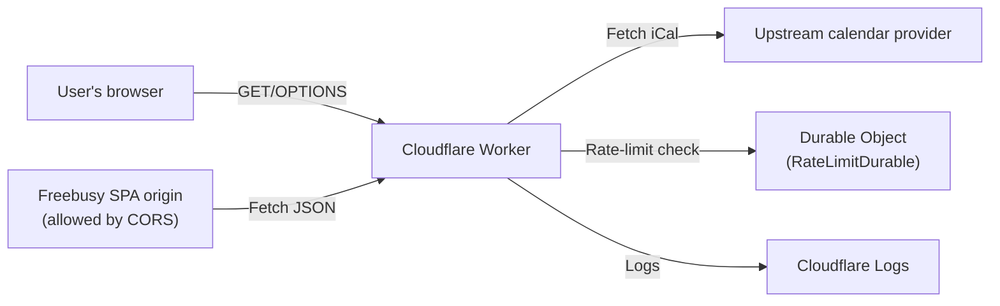
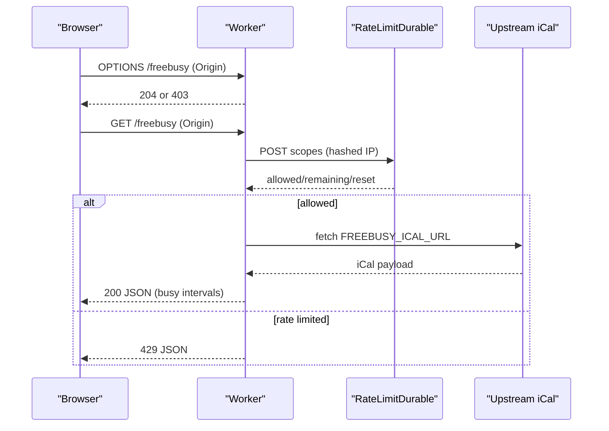

# Threat Model (Freebusy API)

Last reviewed: 2025-12-30
As of: 2025-12-30 (commit: 073c651)

This document is a threat model for Freebusy API.

This is not a penetration test report. It captures security-relevant architecture, threats, and test hypotheses to guide engineering work and to focus any future independent assessment.

- [Threat Model (Freebusy API)](#threat-model-freebusy-api)
  - [0. Summary](#0-summary)
  - [1. Scope and assumptions](#1-scope-and-assumptions)
    - [1.1 Ownership and review](#11-ownership-and-review)
    - [1.2 In scope](#12-in-scope)
    - [1.3 Out of scope](#13-out-of-scope)
    - [1.4 Assumptions](#14-assumptions)
  - [2. Assets](#2-assets)
  - [3. Trust boundaries and data flows](#3-trust-boundaries-and-data-flows)
    - [3.1 System context](#31-system-context)
    - [3.2 Request or runtime flow (simplified)](#32-request-or-runtime-flow-simplified)
  - [4. Threat analysis (STRIDE)](#4-threat-analysis-stride)
    - [4.1 Spoofing](#41-spoofing)
    - [4.2 Tampering](#42-tampering)
    - [4.3 Repudiation](#43-repudiation)
    - [4.4 Information disclosure](#44-information-disclosure)
    - [4.5 Denial of service](#45-denial-of-service)
    - [4.6 Elevation of privilege](#46-elevation-of-privilege)
  - [5. Security requirements (control objectives)](#5-security-requirements-control-objectives)
  - [6. Detection and response](#6-detection-and-response)
  - [7. Pen test guidance](#7-pen-test-guidance)
    - [7.1 Pen test requirements](#71-pen-test-requirements)
    - [7.2 Focus areas flagged by this threat model](#72-focus-areas-flagged-by-this-threat-model)
  - [8. Risk register](#8-risk-register)

## 0. Summary

This section summarizes what the system does and what matters most from a security standpoint. It is intentionally short and should be readable by both engineers and non-engineering stakeholders.

Freebusy API is a Cloudflare Worker that fetches a private upstream iCal feed (configured by secret env), normalizes/strips sensitive details, and serves a minimal JSON free/busy API. The biggest security risks are:

- **Upstream fetch as an SSRF-like capability:** If deployment/config is compromised or misconfigured, the Worker’s outbound fetch capability can be abused.
- **Availability/DoS:** Abuse traffic, upstream instability, or expensive parsing paths can impact uptime.
- **Secret handling and accidental leakage:** Mistakes in logs, repo hygiene, or CI/deploy pipeline can expose secrets or sensitive calendar data.

The current codebase already implements several strong mitigations: strict CORS allowlist, DO-backed rate limiting with salted IP hashing, upstream size limits + timeouts, and log redaction/sanitization.

## 1. Scope and assumptions

This section defines what this threat model covers and the assumptions it relies on. The goal is to prevent scope confusion and avoid false confidence when assumptions change.

Review this section whenever the deployment posture, trust boundaries, or configuration surface changes.

### 1.1 Ownership and review

This subsection identifies who is responsible for keeping the threat model accurate and when it must be revisited. These triggers are intentionally tied to specific classes of change that commonly introduce new risk.

Treat this document like code: update it in the same pull request as any change that materially affects the threats, controls, or assumptions.

- **Owner:** See CODEOWNERS.
- **Review cadence:** Quarterly, and after any security-relevant change.
- **Review triggers:** Any change to CORS behavior, rate limiting, upstream fetch limits/allowlist, iCal parsing behavior, logging/redaction, or CI/workflows/deploy configuration.

### 1.2 In scope

This subsection lists what components and behaviors are analyzed here. If something can materially affect confidentiality, integrity, or availability for this service, it should be listed here.

Items not listed here should be assumed out of scope unless explicitly discussed elsewhere.

- **Worker request handling and responses:** Routing, CORS enforcement, JSON responses, and error handling.
- **Durable Object rate limiter:** DO request flow, storage keys, and intended throttling behavior.
- **Upstream fetch and iCal parsing:** Fetch safety limits and parsing behavior for potentially hostile inputs.
- **Logging and observability choices:** What is logged, what is redacted, and what signals exist for detection.
- **GitHub/CI supply-chain touchpoints:** Workflows and dependency posture that impact integrity.

### 1.3 Out of scope

This subsection lists what is intentionally excluded. Being explicit about exclusions helps readers interpret findings correctly and prevents assuming coverage that is not actually present.

Some exclusions may be covered by other docs or by cloud/platform controls outside this repository.

- **Upstream calendar provider security:** The upstream system’s authentication and storage controls are not assessed here.
- **Client UI XSS posture:** We assume the browser client is separately assessed, but we call out interface risks where relevant.
- **Cloudflare account-level security controls:** 2FA/RBAC/audit controls are recommended but not verified in this doc.

### 1.4 Assumptions

This subsection captures assumptions that materially affect the threat model if violated. Prefer assumptions that can be verified operationally or through configuration review.

If an assumption changes, update the relevant threat sections and the risk register.

- **Secrets are not user-controlled:** `FREEBUSY_ICAL_URL` and `RL_SALT` are treated as secrets and are not user-controlled at runtime.
- **Public reachability:** The Worker is publicly reachable on the internet.
- **Browser clients:** Primary consumers are browsers calling from a known allowed origin.

## 2. Assets

This section enumerates the assets that the system must protect. Assets include secrets, sensitive data, and service capabilities whose misuse can cause harm.

These IDs are referenced implicitly throughout the threats and explicitly in the risk register.

- **A1: Upstream iCal URL (`FREEBUSY_ICAL_URL`):** Secret; disclosure increases the risk of unauthorized calendar access.
- **A2: Calendar content:** Sensitive; disclosure or over-broad output can leak private schedule details.
- **A3: Rate limit salt (`RL_SALT`):** Secret; disclosure weakens privacy guarantees and can enable key reversal/targeting.
- **A4: Rate limit state:** Sensitive-ish; it is primarily an abuse signal, but still security-relevant telemetry.
- **A5: Service availability:** High value; legitimate users must be able to fetch availability reliably.
- **A6: API contract (`docs/openapi.yaml`):** Integrity matters; drift can create client breakage and security foot-guns.

## 3. Trust boundaries and data flows

This section shows the system’s main actors and where trust boundaries exist. The goal is not to perfectly model every edge case, but to provide stable diagrams that support reasoning about data exposure and abuse paths.

Update these diagrams whenever a new actor, boundary, or cross-system dependency is introduced.

### 3.1 System context

This diagram shows the top-level actors and how they interact. It is intended to make trust boundaries obvious: browser origin controls, upstream dependencies, and the Durable Object boundary.

Keep this diagram simple and stable so changes are meaningful.

### 3.2 Request or runtime flow (simplified)

This diagram describes a typical request sequence at runtime. It highlights where CORS is enforced, where rate limiting occurs, and when upstream fetch and parsing is performed.

Use this flow to reason about where failures can occur and which responses should be observable.

## 4. Threat analysis (STRIDE)

This section documents threats using STRIDE categories and ties them to concrete mitigations. The intent is to identify high-value abuse paths, not to produce an exhaustive list of every theoretical vulnerability.

Where useful, the mitigations are written as testable hypotheses that can be validated by unit tests, integration tests, and independent assessment.

### 4.1 Spoofing

This subsection focuses on impersonation and trust-boundary confusion, such as spoofed callers or spoofed identities used by security controls. For this service, “spoofing” often manifests as attempts to bypass browser-origin controls or to influence rate limiting attribution.

The goal is to ensure that identity-related assumptions are explicit and that bypass attempts are understood.

- **Threat:** Origin spoofing / bypassing CORS by using non-browser clients.
  - **Reality:** CORS is not auth; direct clients can call the API.
  - **Impact:** Mostly availability (rate limit consumption), not data confidentiality (API is intentionally public).
  - **Current mitigation:** DO rate limiting; no secrets returned.
  - **Optional mitigations:** Require a custom header (e.g. `X-Freebusy-Client`) and reject if missing. This forces browser attackers into a preflight that is blocked for disallowed origins.

- **Threat:** IP spoofing via `CF-Connecting-IP` header injection.
  - **Reality:** On Cloudflare’s edge, this header is set by Cloudflare; outside Cloudflare it could be spoofed.
  - **Impact:** Rate-limit bypass or targeted throttling.
  - **Current mitigation:** Assumes Cloudflare edge correctness; rate limiting is best-effort.
  - **Optional mitigation:** If used outside Cloudflare, derive IP from the platform-specific request context instead of headers (Workers don’t provide much here, so document this assumption).

### 4.2 Tampering

This subsection focuses on unauthorized modification of code, configuration, or data. For this service, supply-chain integrity and spec/contract integrity are particularly relevant.

Mitigations should be concrete and verifiable via CI configuration, reviews, and test coverage.

- **Threat:** Spec drift / contract tampering.
  - **Impact:** Clients break; potential security foot-guns.
  - **Current mitigation:** Contract tests validate responses against `docs/openapi.yaml`.

- **Threat:** Log tampering / injection.
  - **Impact:** Confusing telemetry.
  - **Current mitigation:** Warnings are sanitized/truncated; upstream URL is origin-redacted.

### 4.3 Repudiation

This subsection focuses on auditability: whether abuse or failures can be investigated safely. The goal is to capture sufficient signal for incident response without collecting or leaking sensitive data.

Controls here should strike a balance between useful diagnostics and privacy.

- **Threat:** Lack of request identifiers / audit trail for abuse incidents.
  - **Impact:** Harder to investigate.
  - **Current state:** Cloudflare logs + rate-limit signals.
  - **Optional mitigation:** Add a request ID (e.g. `crypto.randomUUID()`) and include in logs and responses for 5xx only.

### 4.4 Information disclosure

This subsection focuses on confidentiality and privacy leakage. The most important disclosure risks for this service are secret leakage (upstream URL, salt) and calendar-content leakage (responses, logs).

Mitigations should prioritize preventing accidental disclosure through logs, caching, or cross-origin access.

- **Threat:** Upstream iCal URL leakage.
  - **Current mitigation:** `redactUrl()` logs origin only; env validation errors do not print the URL.
  - **Residual risk:** A future log line might accidentally log the raw env value.
  - **Mitigation:** Keep a “no secret logging” checklist item in PR review; consider a lint rule or a small helper that makes logging the full URL difficult.

- **Threat:** Calendar content leakage via logs.
  - **Current mitigation:** Upstream text is never logged; parse warnings are sanitized.
  - **Residual risk:** If parser warnings ever include raw iCal lines, even truncated, they could contain sensitive content.
  - **Mitigation:** Ensure warnings are structured and never include full raw lines.

- **Threat:** Cross-origin data exposure.
  - **Current mitigation:** Strict allowlist for JSON endpoints; disallowed origins receive `403 forbidden_origin`.
  - **Residual risk:** CORS is only a browser control; it does not prevent non-browser scraping.

- **Threat:** Response caching in browsers/CDNs.
  - **Current mitigation:** `Cache-Control: no-store`.

### 4.5 Denial of service

This subsection focuses on availability risks. The most relevant DoS paths are abusive request patterns, expensive parsing, and upstream instability.

Mitigations should be bounded and measurable: limits, timeouts, caching strategy, and platform protections.

- **Threat:** Burst traffic / scraping.
  - **Current mitigation:** DO rate limiting (per-IP + optional global).
  - **Residual risk:** Distributed traffic across many IPs.
  - **Mitigations:** Add Cloudflare WAF rules, bot protection, Turnstile, or signed token.

- **Threat:** Upstream DoS (slow or huge responses).
  - **Current mitigation:** fetch timeout; max bytes read.
  - **Residual risk:** Expensive upstream TLS handshakes or repeated failures.
  - **Mitigation:** Consider increasing cache TTL during incidents; optionally add conditional requests (ETag) if upstream supports it.

- **Threat:** Parsing DoS.
  - **Current mitigation:** bounded input size; parsing is linear-ish.
  - **Mitigation:** Keep input caps tight; consider early bailout on excessive line counts.

### 4.6 Elevation of privilege

This subsection focuses on gaining capabilities beyond what was intended, including platform-level or supply-chain compromise. For this service, the highest-impact privilege-escalation scenario is a compromised deploy/config path that changes what the Worker can fetch or what it returns.

Mitigations should reduce blast radius and make high-risk changes harder to introduce unnoticed.

- **Threat:** Supply-chain compromise (dependencies, CI, GitHub Actions).
  - **Current mitigation:** lockfile present; Dependabot configured.
  - **Mitigations:** Pin GitHub Actions to commit SHAs; enable branch protection; require reviews for `wrangler.toml`, `docs/openapi.yaml`, and workflow changes.

- **Threat:** Misuse of SSRF capability.
  - **Current state:** Worker fetches a single configured URL, not user-provided.
  - **Mitigation:** Consider enforcing `https:` scheme and forbidding embedded credentials in `FREEBUSY_ICAL_URL`.

## 5. Security requirements (control objectives)

This section lists concrete, testable security requirements derived from the threat analysis. These are intended to be treated as control objectives for engineering and validation.

If a requirement changes, update this document and any adjacent tests or runbook items that validate it.

- **Secrets never logged:** Do not log `FREEBUSY_ICAL_URL`, `RL_SALT`, or raw upstream calendar payload.
- **CORS enforced for JSON:** Disallowed origins return `403` with `{"error":"forbidden_origin"}`; allowed origins receive the expected CORS headers.
- **Preflight behavior fixed:** `OPTIONS` returns `204` for allowed origins; otherwise `403` with an empty body.
- **No caching:** Responses include `Cache-Control: no-store`.
- **Upstream fetch bounded:** Fetch is limited by timeout and a strict max-bytes read.
- **Rate limiting privacy:** IPs are never stored in plaintext; only salted hashes are used for keys.

## 6. Detection and response

This section describes how to detect violations of assumptions and how to respond when something goes wrong. It is intentionally brief; detailed operational steps should live in a runbook.

The goal is to define signals that are actionable and do not require collecting sensitive data.

- **Monitor:** Spikes in `429`, elevated `5xx`, increased upstream fetch failures/timeouts, and sustained increases in parse warnings.
- **Triage:** Confirm whether the issue is abuse traffic, upstream instability, or a deploy/config change.
- **Mitigate quickly:** Tighten Cloudflare WAF/bot rules, enable/adjust global rate limiting, and/or increase cache TTL temporarily during upstream incidents.
- **Post-incident:** Document root cause, update this threat model if assumptions/controls changed, and add/adjust tests for the control objectives above.

## 7. Pen test guidance

This section defines expectations for commissioning an independent assessment. It is meant to be explicit about methodology and to highlight the specific areas a tester should scrutinize for this system.

It also provides a bridge from the threat analysis to an actionable test plan.

This document is a **threat model**, not a penetration test report, and it does not claim that testing has been performed.

If you engage an independent tester, we recommend an assessment aligned with:

- **OWASP Web Security Testing Guide (WSTG):** https://owasp.org/www-project-web-security-testing-guide/
- **OWASP Top 10 (web):** https://owasp.org/www-project-top-ten/
- **OWASP API Security Top 10:** https://owasp.org/www-project-api-security/

### 7.1 Pen test requirements

This subsection describes the minimum requirements for a useful, reproducible assessment. These requirements are intended to prevent ambiguous findings and to ensure the report is actionable.

If scope is limited (for example, staging only), that limitation should be explicitly documented in the report.

- Test against the deployed service as a black box from the public internet.
- Validate CORS and preflight behavior from allowed and disallowed origins.
- Validate rate limiting behavior (per-IP and optional global), including attempts to bypass.
- Validate upstream fetch safety controls (timeout, max bytes, and content-type handling).
- Validate error handling does not leak sensitive details (stack traces, secrets, upstream URL, calendar payload).

### 7.2 Focus areas flagged by this threat model

The items below are the project-specific checks we want the tester to pay close attention to based on the threats identified above.

- **CORS behavior:** Validate that origin handling is correct and cannot be bypassed.
  - **Disallowed origin:** Must get `403` JSON for GET and `403` empty body for OPTIONS.
  - **Allowed origin:** Must receive reflected `Access-Control-Allow-Origin`.

- **Rate limiting:** Validate throttling behavior and confirm privacy properties.
  - **Expected throttle:** Ensure `429` is returned under expected conditions.
  - **Privacy:** Confirm no raw IP is returned in responses/logs.
  - **Distributed abuse:** Attempt multi-IP patterns and confirm any configured global scope behaves as intended.

- **Upstream abuse:** Validate upstream safety controls and SSRF-related assumptions.
  - **Limits:** Confirm upstream content-type enforcement and size limit.
  - **No disclosure:** Confirm upstream URL is never returned.
  - **No influence:** Confirm the service cannot be influenced to fetch attacker-controlled URLs (there is no user-controlled URL input).

- **Error handling:** Validate that failures are safe and do not leak sensitive information.
  - **No stack traces:** Ensure 5xx responses do not leak stack traces.
  - **No sensitive logs:** Confirm logs/telemetry do not include secrets or raw upstream calendar content.

## 8. Risk register

This section summarizes key risks in a compact form so changes can be tracked over time. It is not intended to be exhaustive; it is intended to communicate what matters most and how mitigations change risk.

Each risk should map back to one or more threats and be reducible via concrete controls.

| ID | Risk | Likelihood | Impact | Current controls | Suggested improvement |
|---:|------|------------|--------|------------------|----------------------|
| R1 | Upstream SSRF via compromised config/deploy | Low | High | Env is secret; no user input; redacted logging | Enforce `https:` + no credentials; tighten deployment controls |
| R2 | Forced browsing / rate-limit consumption from other origins | Medium | Medium | Per-IP/global rate limiting | Require custom header or Turnstile to force preflight |
| R3 | Distributed scraping (many IPs) | Medium | Medium/High | Global rate limit optional | WAF/bot protection/Turnstile |
| R4 | Accidental secret logging in future changes | Low | High | Redaction helper + review | Add “no secrets in logs” checklist; consider action pinning |

